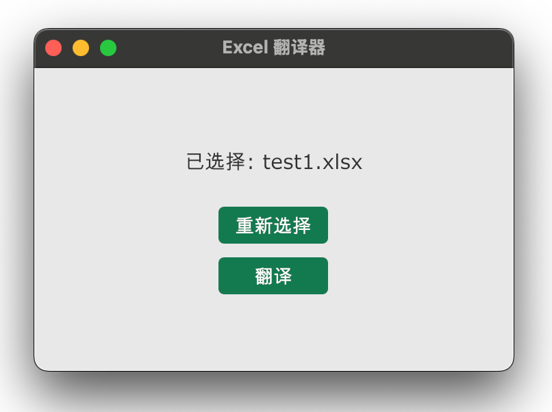

# Excel Translator

一个简单易用的Excel文件翻译工具，可以将Excel文件中的日文内容翻译成中文。

## 主要特性

- 支持Excel文件中的文本单元格翻译
- 支持Excel形状和图表中的文本翻译
- 保留原始格式和样式
- 使用先进的AI模型进行高质量翻译
- 简洁易用的图形界面

## 配置说明

应用程序在首次运行时会在用户配置目录下创建默认配置文件：

- Windows: `%APPDATA%\Exceltranslator\config.toml`
- macOS: `~/Library/Application\ Support/Exceltranslator/config.toml`

你可以编辑此配置文件来自定义应用程序的行为：

```toml
# 客户端设置
[client]
# 最大并发请求数
max_concurrent_requests = 5
# 翻译提示词
prompt = """
你是一个专业的翻译助手，擅长将日文精准翻译成简体中文。
请直接返回翻译结果，不要添加任何解释或引导语。
在翻译过程中保持所有西文字符（字母、数字、符号）不变，并确保专业术语的准确性。
"""
# 是否自动检测中日韩文字（仅翻译包含中日韩文字的文本）
auto_detect_cjk = true

# 大语言模型设置
[llm]
# 使用的模型名称
model = "qwen-plus-latest"
# API 密钥
api_key = "sk-your-api-key-here"
# API 服务器地址
api_url = "https://dashscope.aliyuncs.com/compatible-mode/v1"
```

## 命令行版本

```bash
# 安装依赖
go mod download

# 构建
go build -o bin/exceltranslator cli/main.go

# 运行
./bin/exceltranslator
``` 

## GUI 版本


